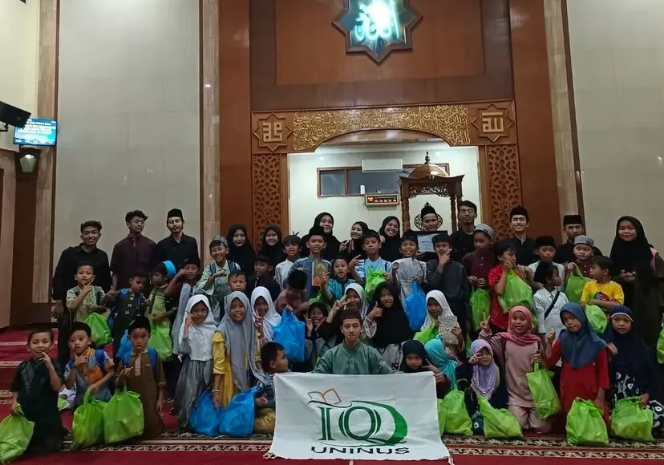
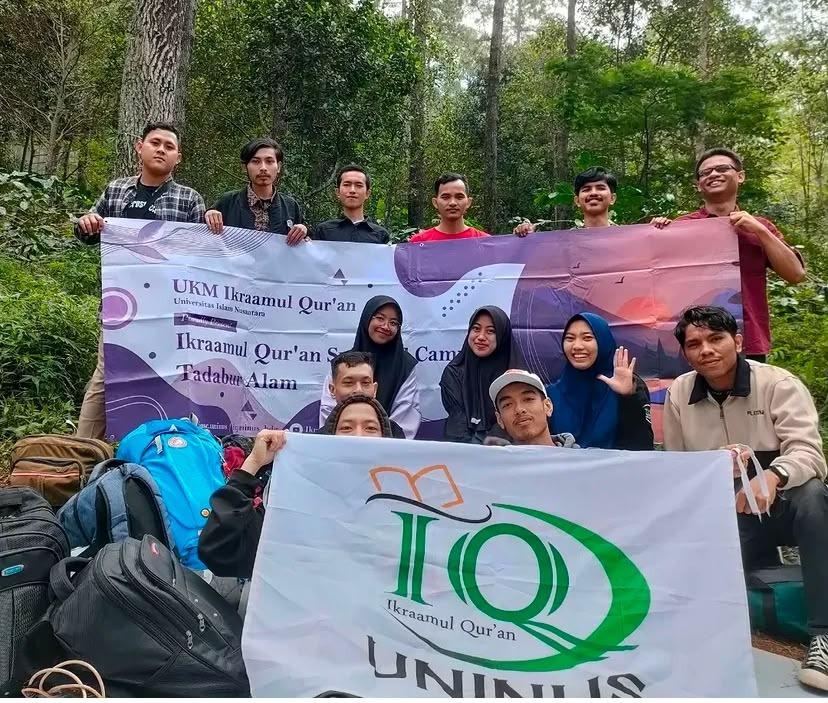

<div align="center">

  

  # 📖 UKM iKRAAMUL QUR'AN
  ### **Digital Smart Dashboard & Islamic Learning Management System**

  [](https://react.dev/)
  [](https://www.typescriptlang.org/)
  [](https://tailwindcss.com/)
  [](https://expressjs.com/)
  [](https://www.mysql.com/)
  [](https://aistudio.google.com/)

  <p align="center">
    Platform Manajemen Digital Modern untuk Kegiatan UKM Ikraamul Qur'an.<br>
    Dilengkapi Presensi Geolocation & QR Code, Setoran Hafalan, Poin Gamifikasi, Laporan Keuangan Kas, dan AI Islami.
  </p>

</div>

---

## 🌟 Fitur Utama Website

| Fitur | Deskripsi |
| :--- | :--- |
| 🔐 **Sistem Autentikasi 3 Role** | Hak akses berjenjang untuk **Admin**, **Pengurus**, dan **Anggota**. |
| 📊 **Dashboard Analitik** | Visualisasi statistik kehadiran, rekap setoran hafalan, dan leaderboard santri. |
| 📍 **Presensi GPS & QR Code** | Validasi kehadiran presisi berbasis radius geolokasi GPS dan scan QR Code dinamis. |
| 📖 **Setoran Hafalan Al-Qur'an** | Pencatatan juz, nama surah, rentang ayat, dan status verifikasi ustadz/pembina. |
| 🏆 **Poin Berkah & Reward** | Gamifikasi XP & Level anggota (Mubtadi' s/d Hafidz) dengan katalog penukaran hadiah. |
| 💰 **Laporan Keuangan & Kas** | Pencatatan transaksi pemasukan, pengeluaran kas, serta donasi QRIS digital. |
| 🤖 **Asisten AI Islami (Gemini)** | Tanya jawab seputar tajwid, tafsir Al-Qur'an, dan fiqih dengan Google Gemini AI. |
| 📄 **Export Laporan PDF** | Cetak rekapitulasi data anggota, presensi, dan setoran hafalan ke dokumen PDF resmi. |

---

## 📸 Preview Galeri Kegiatan

<div align="center">
  
  
</div>

---

## 🛠️ Arsitektur & Teknologi

* **Frontend:** React 19, TypeScript, Vite, TailwindCSS v4, Lucide Icons, Motion Animations, Recharts.
* **Backend:** Node.js, Express.js (REST API).
* **Database:** MySQL 8 / MariaDB Cloud (TiDB Cloud / Aiven) dengan Fallback JSON Store.
* **AI Engine:** Google Gemini API (`@google/genai`).

---

## 🚀 Cara Menjalankan di Lokal (Development)

1. **Clone repository:**
   ```bash
   git clone https://github.com/rizqi6614/Ukm-ikraamul-quran-dashboard.git
   cd Ukm-ikraamul-quran-dashboard
   ```

2. **Install dependencies:**
   ```bash
   npm install
   ```

3. **Buat file `.env`:**
   ```env
   PORT=3000
   NODE_ENV=development
   GEMINI_API_KEY=your_gemini_api_key_here
   DB_HOST=gateway01.ap-southeast-1.prod.aws.tidbcloud.com
   DB_PORT=4000
   DB_USER=37hi9DKVA7wo4KQ.root
   DB_PASSWORD=your_password
   DB_NAME=test
   ```

4. **Jalankan server:**
   ```bash
   npm run dev
   ```
   Buka browser di `http://localhost:3000`.

---

## 🔑 Akun Login Bawaan (Demo)

| Role | Email | Password |
| :--- | :--- | :--- |
| **Admin** | `rizqielektronika@gmail.com` | `rizqielektronika@gmail.com` |
| **Pengurus** | `ahmad@gmail.com` | `ahmad@gmail.com` |
| **Anggota** | `zuhair@gmail.com` | `zuhair@gmail.com` |

---

<div align="center">
  <sub>Dibuat dengan ❤️ untuk kemaslahatan umat & kemajuan <b>UKM iKRAAMUL QUR'AN</b></sub>
</div>
